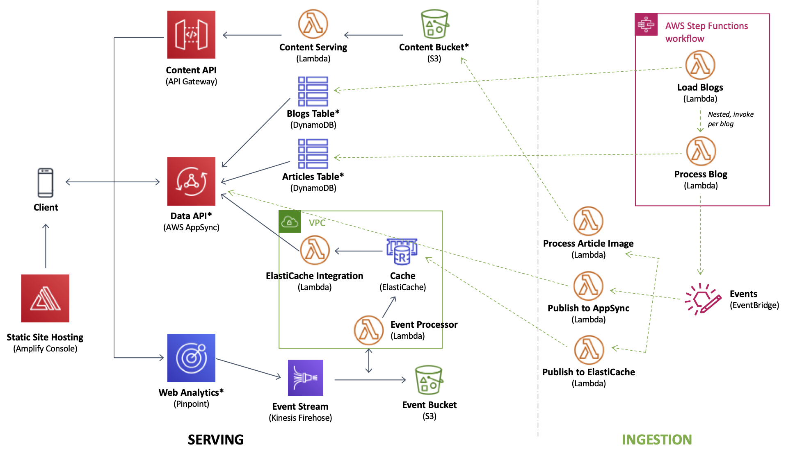
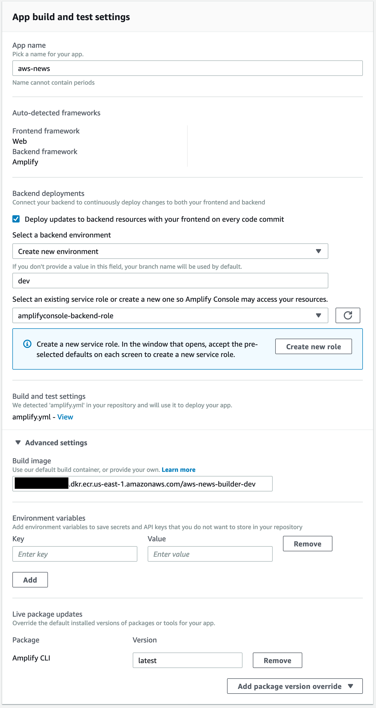

# AWS News

A sample project leveraging AWS Amplify, AWS AppSync, AWS Lambda, Amazon DynamoDB, etc. This project (and a previous incarnation of it) was born out of a desire to test drive a number of new services released by AWS over the past months / year. These primarily include [Amplify DataStore](https://aws-amplify.github.io/docs/js/datastore), [Lambda Layers](https://docs.aws.amazon.com/lambda/latest/dg/configuration-layers.html), [Lambda support for Ruby](https://docs.aws.amazon.com/lambda/latest/dg//lambda-ruby.html), [AWS Step Functions Nested Workflows](https://aws.amazon.com/about-aws/whats-new/2019/08/aws-step-function-adds-support-for-nested-workflows/), and a few others. The project was also an opportunity to build and test a few ideas in a more realistic application.

The resulting product is a news reader that aggregates the various AWS blogs, creating awareness of the content, and a single location to read it. In the future, the application will also attempt to recommend content across blogs.

Project is currently hosted at: https://news.iamjkahn.com.

## Architecture Overview

AWS News is broadly composed of three primary components:

*1. Frontend*
Built with [Next.js](https://nextjs.org/), a React framework for building web applications, the frontend application is a static website served by [AWS Amplify Console](https://aws.amazon.com/amplify/console/). [Amazon Pinpoint](https://aws.amazon.com/pinpoint/) captures user interaction data, streaming it for further processing to [Kinesis Data Firehose](https://aws.amazon.com/kinesis/data-firehose/).

*2. Backend - Ingestion*
Blog post articles are ingested by a process orchestrated by [AWS Step Function](https://aws.amazon.com/step-functions/) and executed by [AWS Lambda](https://aws.amazon.com/lambda/). Articles are ingested by parsing the RSS feed of each AWS blog. Article metadata is stored in [Amazon DynamoDB](https://aws.amazon.com/dynamodb/). The article content and a web-optimized image is stored in [Amazon S3](https://aws.amazon.com/s3/). New content events are published to [Amazon EventBridge](https://aws.amazon.com/eventbridge/).

*3. Backend - Data Plane*
Data for the application is available via GraphQL API built using [AWS AppSync](https://aws.amazon.com/appsync/). The API exposes data stored in DynamoDB tables as well as an [Amazon ElastiCache for Redis](https://aws.amazon.com/elasticache/redis/) cluster (via a Lambda function). [Amazon API Gateway](https://aws.amazon.com/api-gateway/) serves article content and images.



AWS Amplify manages various aspects of the architecture (denoted by an asterisk in the diagram above), including AppSync, DynamoDB, Pinpoint, and S3. Additional resources are managed by [Amazon CloudFormation](https://aws.amazon.com/cloudformation/) stacks using the [Serverless Application Model](https://aws.amazon.com/serverless/sam/).

The application source code is broadly organized across the three categories above. CloudFormation templates and Lambda code for the Backend components are in the `backend/` directory. The Next.js frontend application is in the `next/` directory (note a previous version of the frontend in the `web/` directory). The `amplify/` directory is managed by the Amplify CLI and contains the resource configurations managed by Amplify. The `support/` directory contains support for building AWS News using Amplify Console, more on this below.

## Getting Started

AWS News has been built to allow deployment manually or by using the continuous deployment capabilities provided by Amplify Console. A [Makefile](./Makefile) is used to automate many of the common tasks involved in deploying the project.

### Prerequisites

AWS News requires the following prerequisites:

* [AWS Account](https://aws.amazon.com/account/)
* [Node 12+](https://nodejs.org/en/download/)
* [Amplify CLI (4.10+)](https://aws-amplify.github.io/docs/cli-toolchain/quickstart#quickstart)
* [AWS SAM CLI (1.0+)](https://docs.aws.amazon.com/serverless-application-model/latest/developerguide/serverless-sam-cli-install.html)
* [Docker](https://docs.docker.com/install/)
* [jq](https://stedolan.github.io/jq/download/)

If you are deploying the project manually, without the use of Amplify Console, you will also need to install Ruby 2.7 and other supporting tools.

> Note: AWS offers a [Free Tier](https://aws.amazon.com/free/) for many services, though not all used in this project are part of the Free Tier.

### Deployment

1. Fork this repository, note the URL in your GitHub account.

2. Ensure Docker is running.
   
3. Run the `deploy.support` task to build a custom build image using Docker and push the image to a private image repository created in [Amazon Elastic Container Registry](https://aws.amazon.com/ecr/). Note that building and then pushing the image can take some time, so grab a cup of coffee.

  ``` bash
  make deploy.support
  ```

> *Why a custom build image?* Amplify provides a flexible build image but also supports [custom build image](https://docs.aws.amazon.com/amplify/latest/userguide/custom-build-image.html). For this project, I opted to take the custom route to streamline the image and enable support for Ruby 2.7.

4. Open your favorite browser and go to the AWS Console.

5. Navigate to **Amplify Console**. Here, we will enable our hosting environment as well as continous delivery by connecting a new project to the forked GitHub repository created earlier.

6. Select "Connect App" in Amplify Console.

7. Select GitHub and click "Continue". You may need to authorize Amplify to have access to your GitHub repository.

8. Select your forked `aws-news` repository and the `master` branch. Click "Next".

9. Amplify will automatically detect the React project as well as the custom build settings included in [amplify.yml](./amplify.yml). Create a new backend environment and create a service role (if one does not exist).

10. Expand the "Advanced Settings" section. Copy and paste the URI of your custom build image, e.g. "1234567890.dkr.ecr.us-east-1.amazonaws.com/aws-news-builder-dev". This value was outputted at the end of the `deploy.support` task or can be found by navigating to ECR in the AWS Console.



11. Click "Continue" and confirm on the next screen. Then start your deployment. The initial deployment will take longer than subsquent updates, get another cup of coffee. When finished, Amplify Console will display a custom URL for the deployed application, but there will not be content yet.

> The build process for AWS News makes use of AWS Systems Manager Parameter Store to pass configuration details between various CloudFormation stacks. This is an incredibly useful pattern for building complex infrastructure.

12. To load content, navigate to Step Functions in the AWS Console. Find the state machine named `aws-news-load-blogs-<environment>`. Click on the name of the state machine. On the next page, click the "Start execution" button at the top of the page. The state machine will load the initial list of AWS blogs and start ingestion of content from those blogs.

> Step Functions provides a visual of progress, but you can also navigate to the `aws-news-process-blog-<environment>` state machine to see individual blogs being processed.


13. Navigate to the URL provided by Amplify Console to view AWS News. The frontend has been built to be responsive to screen size, so it will work well across your devices.


#### A Word on Monitoring

Where possible, the default configuration enables tracing using [AWS X-Ray](https://aws.amazon.com/xray/). If you would like to enable tracing of the Data API, you can do so by updating the configuration of the AppSync API.


## Cleaning Up

```
make delete
amplify delete
```

> This project is a work in progress. Please feel free to submit suggestions or pull requests.


## To Do

- [ ] Enhance monitoring -- tracing, logging
- [x] Modify Elasticache resolvers to use direct to Lambda
- [ ] Add personalization and auth needed
- [ ] iOS (SwiftUI)

## Authors

* **Josh Kahn** - *Initial work*

## Acknowledgements

Heitor Lessa's [AWS Serverless Airline Booking](https://github.com/aws-samples/aws-serverless-airline-booking) project helped identify several useful patterns for managing deployment.

## Changes

* **June 2020** - rework organization; add new [SAM support for Step Functions](https://aws.amazon.com/blogs/compute/simplifying-application-orchestration-with-aws-step-functions-and-aws-sam/); add new support for [building layers](https://docs.aws.amazon.com/serverless-application-model/latest/developerguide/building-layers.html)

* **July/August 2020** -- implement SAM CLI GA support for [building layers](https://aws.amazon.com/blogs/compute/the-aws-serverless-application-model-cli-is-now-generally-available/); add progressive loading of images to frontend; pre-process article image and convert to WebP format to improve speed ([1](https://web.dev/serve-responsive-images/), [2](https://web.dev/serve-images-webp/), [3](https://web.dev/uses-responsive-images))